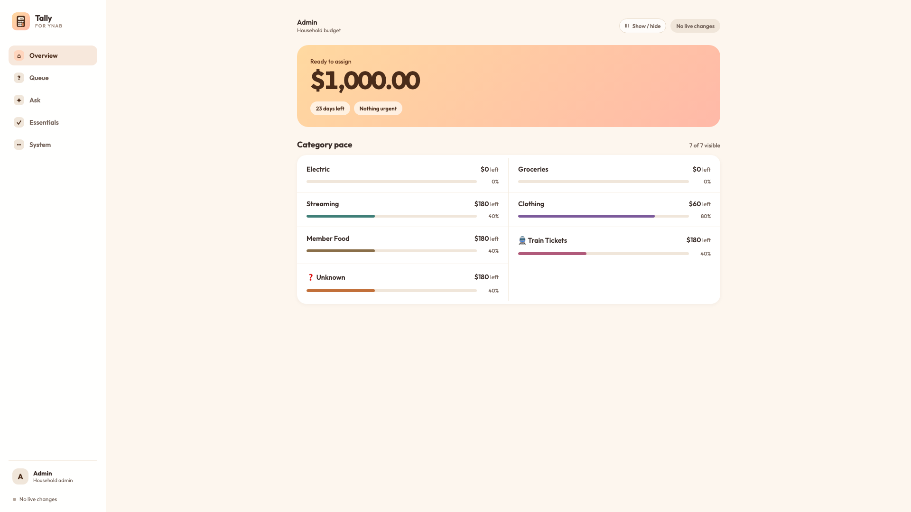
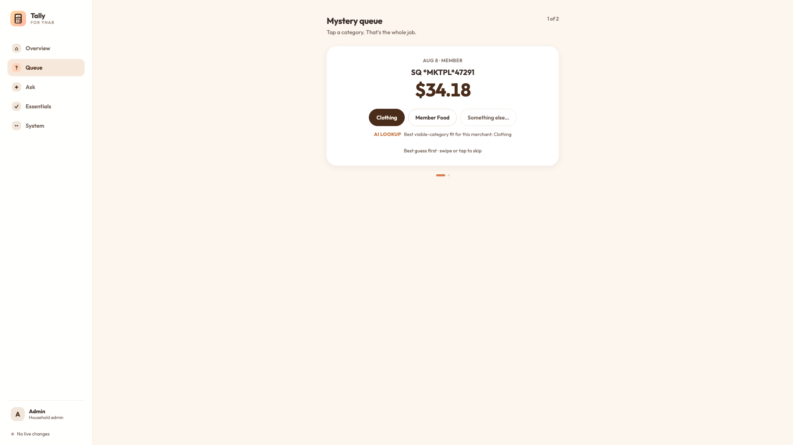
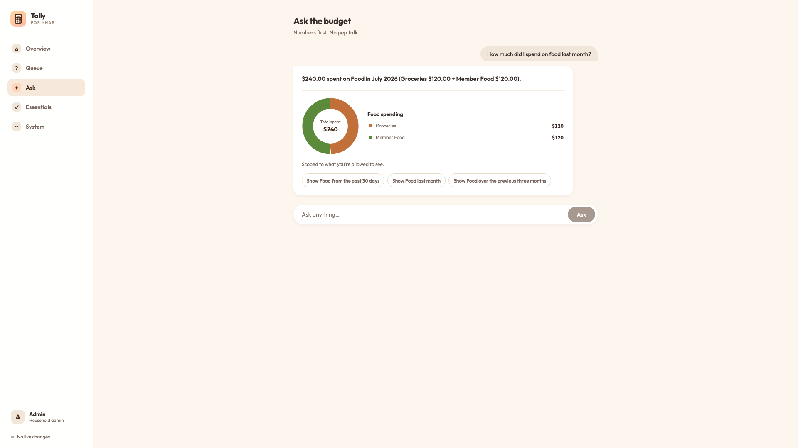

# Tally for YNAB

A self-hosted, white-label companion for YNAB built around two access roles: a
household admin and a household member. It gives each person a focused view of
the categories they care about without implying a limit on household size.

Tally turns a busy budget into a useful daily dashboard. See which important
categories are on track, find and fix uncategorized transactions with AI
suggestions as a starting point, and ask natural-language questions about the
budget. Answers can include clickable charts that drill into the matching
transactions and preserve the period being discussed.

This repository contains only mock data and placeholders. It is safe to run
without YNAB, Anthropic, or Twilio credentials.

## Product tour

### A focused status dashboard

Choose which categories appear on the overview, see how much is assigned or
left, and open any category to review its transactions and monthly pace.



| AI-assisted Mystery Queue | Ask the budget |
| --- | --- |
| Find uncategorized transactions and start with ranked AI suggestions. The user always makes the categorization decision. | Ask about spending, pace, merchants, categories, or time periods and get scoped answers with interactive charts and follow-up actions. |
|  |  |

All screenshots use the built-in mock budget. No real financial data or
credentials are included in this repository.

## What it does

- **Personalized overview:** each user can show or hide categories and focus on
  the balances and pacing signals that matter most to them.
- **Budget pace:** compares spending with the point in the month and highlights
  categories that are on track, need attention, or are off pace.
- **AI-assisted categorization:** the Mystery Queue surfaces uncategorized
  transactions with ranked category suggestions, an explanation, and a manual
  fallback. Suggestions never become writes until a user chooses one.
- **Ask the budget:** read-only, AI-assisted questions return numerical answers,
  category or merchant breakdowns, trends, transaction lists, and clickable
  charts. Follow-up buttons run immediately and retain the relevant date range.
- **Role-based access:** the admin can see household-wide data and system
  controls; the member is limited to configured accounts, category groups, and
  categories.
- **Funding pass and proposals:** a monthly essentials-first funding pass can
  prepare reviewable proposals for the remaining categories, with dry-run and
  approval controls before any live YNAB change.
- **Approval assistant:** familiar, predictable transactions can be reviewed or
  automatically approved using configurable history, consistency, amount, and
  per-sync safeguards.
- **Verified synchronization:** incremental YNAB sync is reconciled before
  downstream jobs run, and the default history window covers the previous 24
  months.

## More features already included

- Category drill-down pages with scoped transaction history.
- Active/unhidden YNAB category syncing for the essentials list.
- User-approved payee-to-category learning after repeated corrections.
- Subscription-creep, placeholder-target, and new-recurring-expense detectors
  that create proposals instead of making surprise changes.
- Spend-threshold alerts, Mystery Queue digests, and proposal approval by SMS.
- One-time SMS sign-in links with a six-digit PIN fallback, expiration, rate
  limits, and lockout protection.
- A dry-run write gateway, reversal hints, and an audit log for every proposed
  or executed YNAB mutation.
- Installable PWA support, responsive layouts, Docker deployment, optional
  Cloudflare Tunnel, and optional Litestream backups.
- Mock external services, seeded demo data, automated tests, and CI checks for
  safe evaluation before connecting a real budget.

## Try it locally

Requirements: Node.js 22+, npm, and optionally Docker.

```sh
cp .env.example .env
npm ci
npm run dev
```

Open `http://localhost:5173`. The example admin PIN is unset by default; either
add six-digit `ADMIN_PIN` and `MEMBER_PIN` values or use `/auth/mock/admin` and
`/auth/mock/member` while `MOCK_EXTERNALS=true`.

## White-label it

1. Edit `web/brand.config.ts` for the app name, tagline, operator, contact email,
   and policy effective date.
2. Replace the files in `web/public/brand/` with your own SVG and PNG assets.
3. Set `APP_NAME`, `ADMIN_NAME`, and `MEMBER_NAME` in `.env`.
4. Adjust `config/essentials.json` and `config/thresholds.json` for your budget.
5. Replace the example color tokens at the top of `web/src/styles.css` if wanted.

The source uses generic `admin` and `member` IDs. Names and phone numbers live
only in the ignored `.env` file.

## Connect real services

Keep both safety switches on until the complete dry-run checklist passes:

```env
DRY_RUN=true
MOCK_EXTERNALS=false
```

Then provide:

- a YNAB personal access token and budget ID;
- Anthropic API credentials for AI inference;
- Twilio credentials if you want SMS sign-in or notifications;
- the member's YNAB account, category-group, and optional category IDs;
- a random session secret of at least 32 characters.

Never commit `.env`, databases, backup credentials, phone numbers, PINs, or
tunnel tokens. SMS registration, consent language, privacy terms, and carrier
requirements are the deployer's responsibility.

## Validate

```sh
npm test
npm run build
docker compose config
```

## Docker

```sh
cp .env.example .env
docker compose up --build -d
```

The app listens on host port `3030`. Optional Cloudflare Tunnel and Litestream
services are in the `live` profile and require your own protected credentials.
See `docs/OPERATIONS.md` before enabling writes.

## Safety model

- `DRY_RUN=true` logs proposed YNAB writes without applying them.
- Mock mode cannot be combined with live writes.
- Sync reconciliation pauses downstream jobs when local and YNAB unapproved
  transaction counts disagree.
- Member access is scoped to configured YNAB accounts and categories.
- Magic links expire after 15 minutes, work once, and are rate-limited.
- Five failed PIN attempts lock that profile for 15 minutes.

## License

MIT. Tally is an independent companion and is not endorsed by or affiliated
with YNAB.
